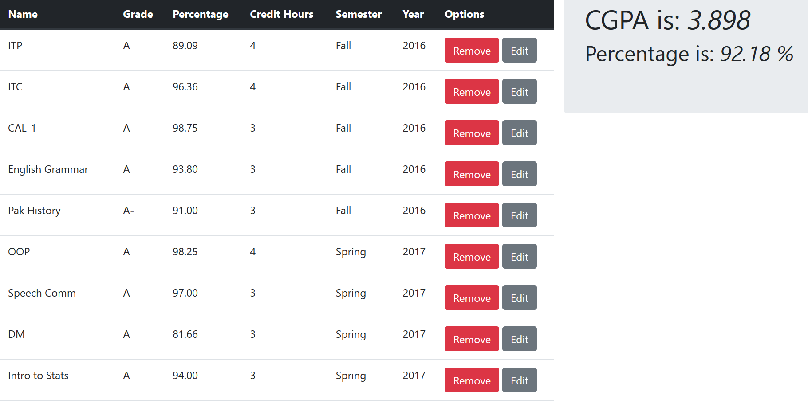

# Course Gradebook



* Follows the [IBA Grading Plan](https://www.iba.edu.pk/gradingplan.php) (as of August 2020)
* Grades can be only of the following categories
  * A
  * A-
  * B+
  * B
  * C+
  * C
  * C-
  * F

## Usage

To use Django applicaiton on your local server please type the following command:

```
python manage.py runserver
```

Please ensure you have all the dependecies installed, aka Python 3.7 and Django 2.2 or greater.

Feedback is much appreciated 😊
